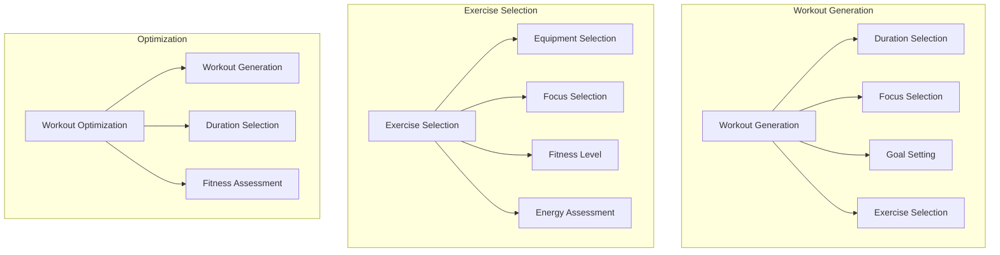

# Workflow Cross-Reference Diagrams

## User Interactions Cross-References

```mermaid
graph TD
    subgraph "Duration Selection"
        D[Duration Selection]
        D_E[Energy Assessment]
        D_F[Fitness Assessment]
        D_W[Workout Generation]
    end

    subgraph "Energy Assessment"
        E[Energy Assessment]
        E_P[Profile Validation]
        E_D[Duration Selection]
        E_A[Workout Adaptation]
    end

    subgraph "Focus Selection"
        F[Focus Selection]
        F_G[Goal Setting]
        F_E[Equipment Selection]
        F_W[Workout Generation]
    end

    D --> D_E
    D_E --> D_F
    D_F --> D_W

    E --> E_P
    E_P --> E_D
    E_D --> E_A

    F --> F_G
    F_G --> F_E
    F_E --> F_W
```

## AI Generation Cross-References

```mermaid
graph TD
    subgraph "Workout Generation"
        W[Workout Generation]
        W_D[Duration Selection]
        W_F[Focus Selection]
        W_G[Goal Setting]
        W_E[Exercise Selection]
    end

    subgraph "Exercise Selection"
        E[Exercise Selection]
        E_EQ[Equipment Selection]
        E_F[Focus Selection]
        E_FL[Fitness Level]
        E_EN[Energy Assessment]
    end

    subgraph "Optimization"
        O[Workout Optimization]
        O_W[Workout Generation]
        O_D[Duration Selection]
        O_F[Fitness Assessment]
    end

    W --> W_D
    W --> W_F
    W --> W_G
    W --> W_E

    E --> E_EQ
    E --> E_F
    E --> E_FL
    E --> E_EN

    O --> O_W
    O --> O_D
    O --> O_F
```

## Monitoring Cross-References

```mermaid
graph TD
    subgraph "Performance Monitoring"
        P[Performance Monitoring]
        P_M[Metrics Collection]
        P_A[Alerting]
        P_H[Health Checking]
    end

    subgraph "Error Tracking"
        E[Error Tracking]
        E_H[Error Handling]
        E_A[Alerting]
        E_M[Metrics Collection]
    end

    subgraph "Health Checking"
        H[Health Checking]
        H_P[Performance Monitoring]
        H_E[Error Tracking]
        H_M[Metrics Collection]
    end

    P --> P_M
    P_M --> P_A
    P_A --> P_H

    E --> E_H
    E_H --> E_A
    E_A --> E_M

    H --> H_P
    H_P --> H_E
    H_E --> H_M
```

## Validation Cross-References

```mermaid
graph TD
    subgraph "Input Validation"
        I[Input Validation]
        I_D[Data Sanitization]
        I_E[Error Tracking]
        I_S[Safety Validation]
    end

    subgraph "Safety Validation"
        S[Safety Validation]
        S_F[Fitness Assessment]
        S_E[Equipment Selection]
        S_W[Workout Generation]
    end

    subgraph "Profile Validation"
        P[Profile Validation]
        P_D[Data Sanitization]
        P_E[Energy Assessment]
        P_F[Fitness Assessment]
    end

    I --> I_D
    I_D --> I_E
    I_E --> I_S

    S --> S_F
    S_F --> S_E
    S_E --> S_W

    P --> P_D
    P_D --> P_E
    P_E --> P_F
``` 