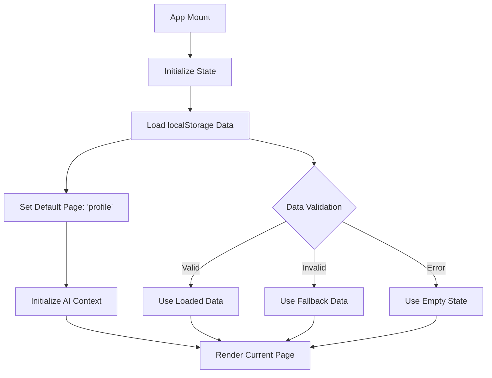

# App Initialization Workflow

## Overview

The App Initialization Workflow determines which page displays on app load/refresh based on existing data state and user progress through the workout creation flow. This workflow is critical for user experience, ensuring users can resume their progress seamlessly.

## Architecture

### Core Components

- **`App.tsx`** - Main application component
- **`AppContent`** - Content wrapper with state management
- **`AIComposedProvider`** - AI context provider
- **Page Components** - Individual page implementations

### Data Flow



## Workflow Stages

### 1. Application Mount

**Trigger:** React component tree initialization
**Component:** `App.tsx` → `AppContent`

```typescript
function App() {
  return (
    <AIComposedProvider>
      <AppContent />
    </AIComposedProvider>
  );
}
```

**Process:**
- AI context providers are initialized
- AppContent component mounts
- State management begins

### 2. Initial State Setup

**Component:** `AppContent` in `App.tsx`
**Location:** Lines 231-232

```typescript
const [currentPage, setCurrentPage] = useState<PageType>('profile');
const [showEnvironmentBanner, setShowEnvironmentBanner] = useState(true);
```

**Key Characteristics:**
- **Fixed Default**: Always starts with `'profile'` page
- **No Smart Detection**: Does not check data completion status
- **Static Initialization**: Page choice is independent of data state

### 3. Data Loading from localStorage

**Component:** `AppContent` in `App.tsx`
**Location:** Lines 233-260

**Input Sources:**
- `localStorage.getItem('profileData')`
- `localStorage.getItem('workoutType')`
- `localStorage.getItem('waiverData')` (not currently loaded)
- `localStorage.getItem('workoutFocusData')` (not currently loaded)

**Loading Process:**
```typescript
const [appState, setAppState] = useState<AppState>(() => {
  try {
    const profileData = localStorage.getItem('profileData');
    const workoutType = localStorage.getItem('workoutType') as WorkoutType | null;
    
    if (profileData) {
      const parsed = JSON.parse(profileData);
      
      if (parsed.data) { // Enhanced persisted state format
        return {
          profileData: parsed.data,
          waiverData: null,
          workoutFocusData: null,
          workoutType: workoutType,
          generatedWorkout: null
        };
      }
    }
  } catch (error) {
    aiLogger.warn('Failed to load profile data from localStorage', { 
      error: error instanceof Error ? error.message : String(error) 
    });
  }
  
  return {
    profileData: null,
    waiverData: null,
    workoutFocusData: null,
    workoutType: null,
    generatedWorkout: null
  };
});
```

**Data Validation:**
- JSON parsing validation
- Enhanced state format detection (`parsed.data`)
- Fallback to empty state on errors

### 4. AI Context Initialization

**Component:** `useAIInitialization` hook
**Location:** Line 266

```typescript
useAIInitialization(appState.profileData);
```

**Process:**
- Initializes AI service context
- Sets up monitoring systems
- Validates profile data completeness
- Provides fallback data for incomplete profiles

### 5. Page Component Resolution

**Component:** `AppContent` in `App.tsx`
**Location:** Lines 422-423

```typescript
const pages = [
  { id: 'profile', title: 'Profile', icon: User, component: ProfilePage },
  { id: 'waiver', title: 'Waiver', icon: Shield, component: LiabilityWaiverPage },
  { id: 'focus', title: 'Workout Focus', icon: Target, component: WorkoutFocusPage },
  { id: 'review', title: 'Review', icon: Eye, component: ReviewPage },
  { id: 'results', title: 'Results', icon: Zap, component: WorkoutResultsPage },
  ...(process.env.NODE_ENV === 'development' ? [
    { id: 'devtools', title: 'AIDevTools', icon: Settings, component: AIDevToolsDemo }
  ] : [])
];

const currentPageIndex = pages.findIndex(page => page.id === currentPage);
const CurrentPageComponent = pages[currentPageIndex].component;
```

**Process:**
- Maps page ID to component
- Handles development-only pages
- Provides type-safe component resolution

## Current Limitations

### 1. No Smart Page Determination

**Issue:** App always starts at 'profile' regardless of data completion
**Impact:** Poor UX for returning users who must navigate through completed steps

**Current Behavior:**
```typescript
// MISSING: Smart page determination logic
const [currentPage, setCurrentPage] = useState<PageType>('profile');
// Should be: determineInitialPage(appState)
```

### 2. Incomplete Data Loading

**Issue:** Only loads profile data, ignores other workflow data
**Missing Data:**
- `waiverData` from localStorage
- `workoutFocusData` from localStorage
- User's last active page

### 3. No Progress Tracking

**Issue:** Cannot resume from user's last incomplete step
**Impact:** Users must manually navigate through completed steps

### 4. Limited Error Recovery

**Issue:** Basic error handling with fallback to empty state
**Missing:** Data validation, corruption detection, recovery strategies

## Error Handling

### localStorage Access Errors

**Error Types:**
- JSON parsing failures
- Storage access denied
- Corrupted data structures

**Current Handling:**
```typescript
try {
  const profileData = localStorage.getItem('profileData');
  // ... parsing logic
} catch (error) {
  aiLogger.warn('Failed to load profile data from localStorage', { 
    error: error instanceof Error ? error.message : String(error) 
  });
  // Fallback to empty state
}
```

**Recommendations:**
- Add data validation layer
- Implement data corruption detection
- Provide user feedback for data issues

### Data Validation Errors

**Current State:** No validation on loaded data
**Risk:** Corrupted data can cause runtime errors
**Recommendation:** Add comprehensive validation

## Integration Points

### Upstream Dependencies

- **[Profile Validation](../data-validation/profile-validation-workflow.md)** - Validates loaded profile data
- **[Data Sanitization](../data-validation/data-sanitization-workflow.md)** - Cleans localStorage data
- **[AI Service Initialization](../ai-generation/ai-service-initialization.md)** - Sets up AI context

### Downstream Consumers

- **[Profile Page](../user-interactions/profile-workflow.md)** - Default landing page
- **[Navigation System](../user-interactions/navigation-workflow.md)** - Handles subsequent page changes
- **[Data Persistence](../system-orchestration/data-persistence-workflow.md)** - How data gets saved

### Related Workflows

- **[Session Management](../system-orchestration/session-management-workflow.md)** - User session lifecycle
- **[Error Handling](../monitoring-observability/error-handling-workflow.md)** - Error recovery strategies

## Recommended Improvements

### 1. Smart Page Determination

**Implementation:**
```typescript
const determineInitialPage = (appState: AppState): PageType => {
  if (!isProfileComplete(appState.profileData)) return 'profile';
  if (!isWaiverComplete(appState.waiverData)) return 'waiver';  
  if (!isWorkoutFocusComplete(appState.workoutFocusData)) return 'focus';
  if (appState.generatedWorkout) return 'results';
  return 'review';
};

// Enhanced initialization
const [currentPage, setCurrentPage] = useState<PageType>(() => 
  determineInitialPage(initialAppState)
);
```

### 2. Complete Data Loading

**Enhanced Loading:**
```typescript
const loadCompleteAppState = (): AppState => {
  try {
    const profileData = localStorage.getItem('profileData');
    const waiverData = localStorage.getItem('waiverData');
    const workoutFocusData = localStorage.getItem('workoutFocusData');
    const workoutType = localStorage.getItem('workoutType');
    const generatedWorkout = localStorage.getItem('generatedWorkout');
    
    return {
      profileData: profileData ? JSON.parse(profileData).data : null,
      waiverData: waiverData ? JSON.parse(waiverData).data : null,
      workoutFocusData: workoutFocusData ? JSON.parse(workoutFocusData).data : null,
      workoutType: workoutType as WorkoutType | null,
      generatedWorkout: generatedWorkout ? JSON.parse(generatedWorkout).data : null
    };
  } catch (error) {
    // Enhanced error handling
    return getEmptyAppState();
  }
};
```

### 3. Progress Persistence

**Implementation:**
```typescript
// Save current page
const saveCurrentPage = (page: PageType) => {
  localStorage.setItem('lastActivePage', page);
};

// Load last active page
const getLastActivePage = (): PageType => {
  return localStorage.getItem('lastActivePage') as PageType || 'profile';
};
```

### 4. Data Validation Layer

**Implementation:**
```typescript
const validateAndRestoreData = (rawData: string, dataType: string) => {
  try {
    const parsed = JSON.parse(rawData);
    
    switch (dataType) {
      case 'profile':
        return isValidProfileData(parsed.data) ? parsed.data : null;
      case 'waiver':
        return isValidWaiverData(parsed.data) ? parsed.data : null;
      case 'workoutFocus':
        return isValidWorkoutFocusData(parsed.data) ? parsed.data : null;
      default:
        return null;
    }
  } catch (error) {
    aiLogger.error('Data validation failed', { dataType, error });
    return null;
  }
};
```

## Metrics & Monitoring

### Key Metrics

- **Initial page load time** - Performance measurement
- **Data restoration success rate** - Reliability measurement
- **User drop-off at profile page** - UX measurement
- **Data corruption frequency** - Quality measurement

### Logging Points

```typescript
// App initialization start/complete
aiLogger.info('App initialization started');
aiLogger.info('App initialization completed', { 
  initialPage, 
  dataLoaded: !!appState.profileData 
});

// localStorage data loading success/failure
aiLogger.debug('localStorage data loaded', { 
  hasProfileData: !!profileData,
  hasWaiverData: !!waiverData,
  hasWorkoutFocusData: !!workoutFocusData 
});

// Initial page determination
aiLogger.debug('Initial page determined', { 
  page: currentPage, 
  reason: getPageDeterminationReason(appState) 
});

// Data validation results
aiLogger.debug('Data validation completed', { 
  profileValid: isProfileValid,
  waiverValid: isWaiverValid,
  workoutFocusValid: isWorkoutFocusValid 
});
```

## Testing Strategy

### Unit Tests

**Test Scenarios:**
- localStorage data loading scenarios
- Error handling paths
- Initial state determination
- Page component resolution
- Data validation logic

**Test Files:**
- `src/App.test.tsx`
- `src/hooks/useAppInitialization.test.ts`
- `src/utils/dataValidation.test.ts`

### Integration Tests

**Test Scenarios:**
- Full app initialization flow
- Data persistence/restoration cycle
- Navigation between pages
- Error recovery scenarios

**Test Files:**
- `__tests__/integration/AppInitialization.test.ts`
- `__tests__/integration/DataPersistence.test.ts`

### User Tests

**Test Scenarios:**
- First-time user experience
- Returning user resume functionality
- Data corruption recovery
- Cross-browser compatibility

## Implementation Priority

### Phase 1: Critical Fixes
1. **Smart page determination** - High impact, low risk
2. **Complete data loading** - High impact, medium risk
3. **Enhanced error handling** - Medium impact, low risk

### Phase 2: UX Improvements
1. **Progress persistence** - Medium impact, low risk
2. **Data validation layer** - Medium impact, medium risk
3. **User feedback for data issues** - Low impact, low risk

### Phase 3: Advanced Features
1. **Cross-tab synchronization** - Low impact, high complexity
2. **Data migration strategies** - Low impact, high complexity
3. **Offline support** - Low impact, high complexity

## Conclusion

The current App Initialization Workflow provides a functional foundation but lacks smart page determination and complete data restoration. The recommended improvements would significantly enhance user experience by allowing seamless resumption of workflow progress and providing robust error handling for data integrity issues.

The implementation should prioritize smart page determination and complete data loading as these provide the highest user experience impact with manageable implementation complexity. 