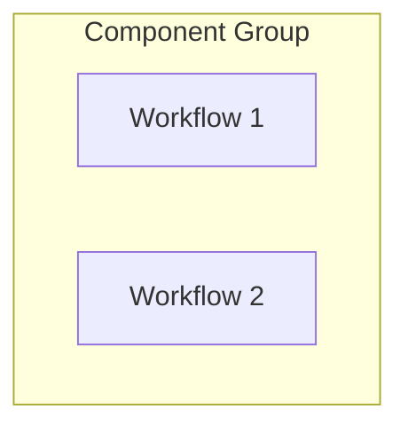
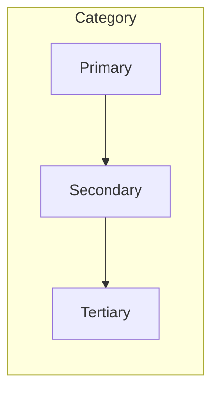
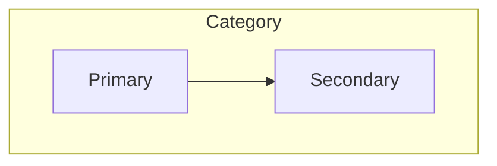
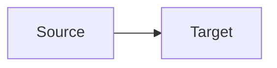

# Workflow Diagrams

This directory contains Mermaid diagrams visualizing the relationships and interactions between system workflows.

## Directory Structure

```
diagrams/
├── workflow-overview.md     # High-level system workflow diagrams
├── workflow-cross-references.md  # Detailed cross-reference diagrams
└── README.md               # This file
```

## Diagram Guidelines

### 1. Diagram Types

#### System Overview Diagrams
- Use `graph TD` (top-down) for hierarchical relationships
- Group related workflows using `subgraph`
- Keep to maximum 4-5 major component groups
- Show primary data flow between components

Example:


#### Cross-Reference Diagrams
- Use `graph TD` for hierarchical relationships
- Use `graph LR` for linear processes
- Group by workflow category
- Show dependencies and data flow
- Include component descriptions

Example:


### 2. Naming Conventions

#### Node IDs
- Use category prefix (e.g., UI_, AI_, DV_)
- Use descriptive suffixes
- Keep IDs short but meaningful

Examples:
- `UI_D[Duration Selection]`
- `AI_W[Workout Generation]`
- `DV_I[Input Validation]`

#### Subgraph Titles
- Use quoted strings
- Start with category name
- Be concise but clear

Example:
```mermaid
subgraph "User Interactions"
    UI_Components
end
```

### 3. Visual Style

#### Node Formatting
- Use square brackets for workflow nodes: `[Workflow Name]`
- Use parentheses for process nodes: `(Process)`
- Use diamonds for decision nodes: `{Decision}`

#### Arrow Types
- `-->` for standard flow
- `-.->` for optional/conditional flow
- `==>` for critical path flow

### 4. Organization

#### Workflow Categories
- User Interactions
- AI Generation
- Data Validation
- Feature Flags
- Developer Tools
- System Orchestration
- Monitoring & Observability

#### Relationship Types
- Upstream Dependencies
- Downstream Consumers
- Related Workflows
- Integration Points

### 5. Adding New Diagrams

1. Create a new .md file with a descriptive name
2. Start with a clear title and overview
3. Include all relevant diagram types
4. Follow naming and style conventions
5. Add cross-references to existing diagrams
6. Update this README if adding new conventions

### 6. Best Practices

1. **Clarity**
   - Keep diagrams focused and uncluttered
   - Use clear, consistent naming
   - Group related elements

2. **Completeness**
   - Show all critical relationships
   - Include necessary context
   - Document assumptions

3. **Consistency**
   - Follow established conventions
   - Use standard node types
   - Maintain uniform style

4. **Maintainability**
   - Comment complex sections
   - Break large diagrams into modules
   - Keep documentation updated

### 7. Example Template

```markdown
# Workflow Category Diagram

## Overview
Brief description of what this diagram represents.

## System View


## Cross-References


## Notes
- Important considerations
- Key relationships
- Special cases
```

## Updating Diagrams

1. Review existing diagrams for consistency
2. Follow the established conventions
3. Update cross-references as needed
4. Document significant changes
5. Test diagram rendering before committing

## Tools

- Use Mermaid.js for all diagrams
- Test diagrams using the Mermaid Live Editor
- Verify rendering in documentation platform 