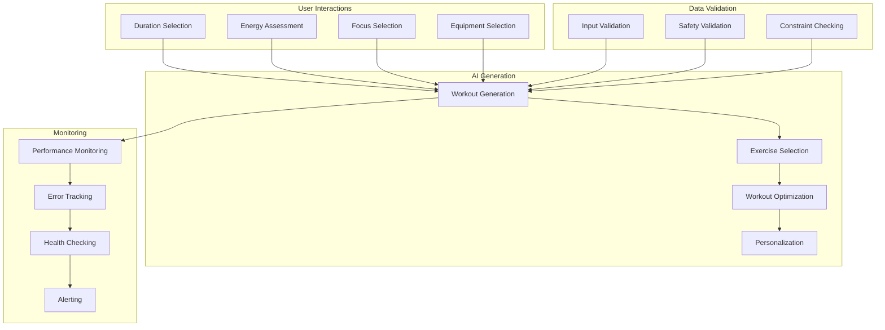
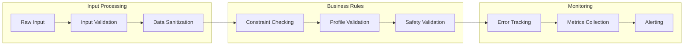
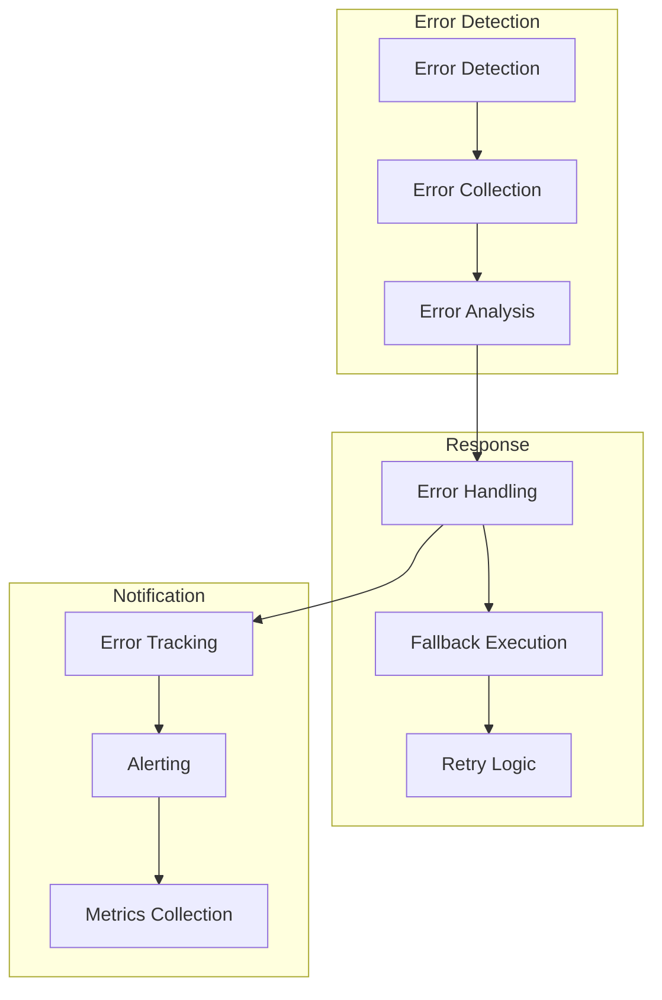
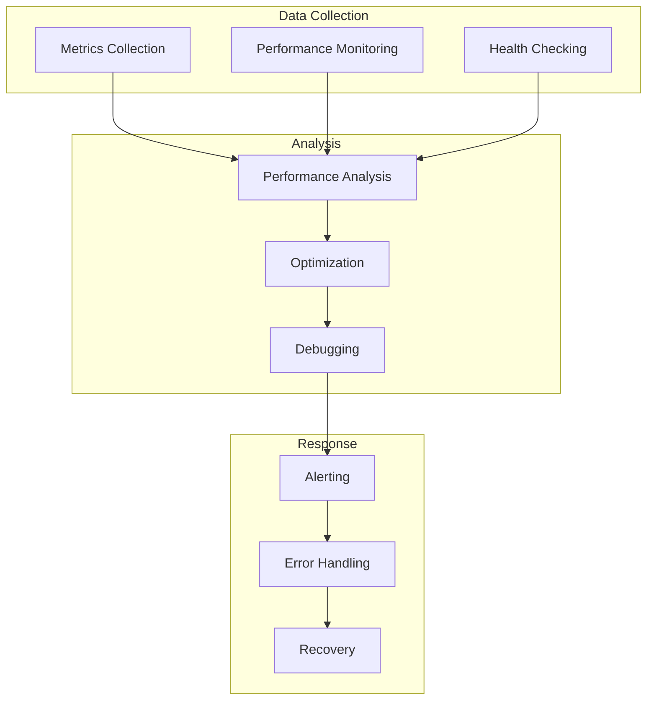

# Workflow Overview Diagrams

## High-Level System Workflow

```mermaid
graph TD
    subgraph "User Interactions"
        UI_D[Duration Selection]
        UI_E[Energy Assessment]
        UI_F[Focus Selection]
        UI_EQ[Equipment Selection]
    end

    subgraph "AI Generation"
        AI_W[Workout Generation]
        AI_E[Exercise Selection]
        AI_O[Workout Optimization]
        AI_P[Personalization]
    end

    subgraph "Data Validation"
        DV_I[Input Validation]
        DV_S[Safety Validation]
        DV_C[Constraint Checking]
    end

    subgraph "Monitoring"
        M_P[Performance Monitoring]
        M_E[Error Tracking]
        M_H[Health Checking]
        M_A[Alerting]
    end

    UI_D --> AI_W
    UI_E --> AI_W
    UI_F --> AI_W
    UI_EQ --> AI_W

    AI_W --> AI_E
    AI_E --> AI_O
    AI_O --> AI_P

    DV_I --> AI_W
    DV_S --> AI_W
    DV_C --> AI_W

    AI_W --> M_P
    M_P --> M_E
    M_E --> M_H
    M_H --> M_A
```

## Validation Flow

```mermaid
graph LR
    subgraph "Input Processing"
        I_R[Raw Input]
        I_V[Input Validation]
        I_S[Data Sanitization]
    end

    subgraph "Business Rules"
        B_C[Constraint Checking]
        B_P[Profile Validation]
        B_S[Safety Validation]
    end

    subgraph "Monitoring"
        M_E[Error Tracking]
        M_M[Metrics Collection]
        M_A[Alerting]
    end

    I_R --> I_V
    I_V --> I_S
    I_S --> B_C
    B_C --> B_P
    B_P --> B_S
    B_S --> M_E
    M_E --> M_M
    M_M --> M_A
```

## Error Handling Flow

```mermaid
graph TD
    subgraph "Error Detection"
        E_D[Error Detection]
        E_C[Error Collection]
        E_A[Error Analysis]
    end

    subgraph "Response"
        R_H[Error Handling]
        R_F[Fallback Execution]
        R_R[Retry Logic]
    end

    subgraph "Notification"
        N_T[Error Tracking]
        N_A[Alerting]
        N_M[Metrics Collection]
    end

    E_D --> E_C
    E_C --> E_A
    E_A --> R_H
    R_H --> R_F
    R_F --> R_R
    R_H --> N_T
    N_T --> N_A
    N_A --> N_M
```

## Monitoring Flow

```mermaid
graph TD
    subgraph "Data Collection"
        D_M[Metrics Collection]
        D_P[Performance Monitoring]
        D_H[Health Checking]
    end

    subgraph "Analysis"
        A_P[Performance Analysis]
        A_O[Optimization]
        A_D[Debugging]
    end

    subgraph "Response"
        R_A[Alerting]
        R_E[Error Handling]
        R_R[Recovery]
    end

    D_M --> A_P
    D_P --> A_P
    D_H --> A_P
    A_P --> A_O
    A_O --> A_D
    A_D --> R_A
    R_A --> R_E
    R_E --> R_R
``` 