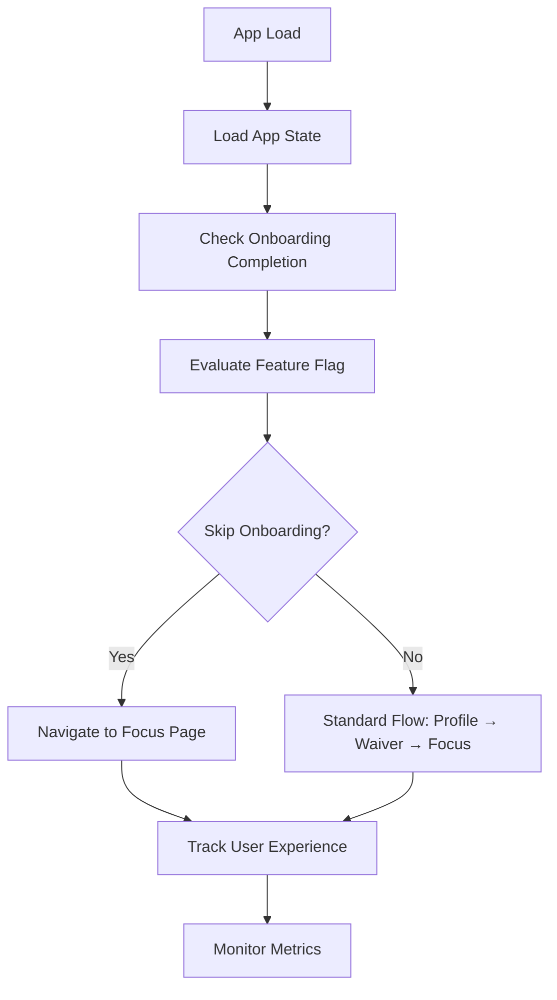

# Skip Onboarding Workflow

## Overview

The Skip Onboarding Workflow uses feature flags to determine whether returning users should skip the profile and liability waiver steps, going directly to the workout focus page. This workflow enhances user experience by reducing friction for users who have already completed the onboarding process.

## Architecture

### Core Components

- **Feature Flag System** - `AIFeatureFlagsProvider` and `FeatureFlagService`
- **App Initialization** - `App.tsx` with enhanced page determination logic
- **Onboarding Tracking** - localStorage-based completion tracking
- **User Context** - Profile data and completion status

### Data Flow



## Workflow Stages

### 1. Onboarding Completion Check
- **Trigger:** App initialization
- **Component:** `App.tsx` - `determineInitialPage`
- **Inputs:** localStorage data, app state
- **Process:** Check for completed onboarding flow
- **Outputs:** Completion status boolean

### 2. Feature Flag Evaluation
- **Trigger:** Onboarding completion detected
- **Component:** `FeatureFlagService` - `isEnabled`
- **Inputs:** Flag ID, user context, completion status
- **Process:** Evaluate skip-onboarding-flow flag
- **Outputs:** Flag resolution (enabled/disabled)

### 3. Page Determination
- **Trigger:** Feature flag evaluation complete
- **Component:** `App.tsx` - `determineInitialPage`
- **Inputs:** Flag result, completion status
- **Process:** Determine initial page based on flag and data
- **Outputs:** Initial page type

### 4. Onboarding Completion Tracking
- **Trigger:** Waiver completion
- **Component:** `LiabilityWaiverPage` - `handleWaiverComplete`
- **Inputs:** Waiver data
- **Process:** Mark onboarding as complete
- **Outputs:** localStorage update, navigation

## Implementation Details

### Feature Flag Configuration

```typescript
// Feature flag: 'skip-onboarding-flow'
const shouldSkipOnboarding = await flagEvaluationWorkflow.evaluate({
  flagId: 'skip-onboarding-flow',
  userId,
  context: {
    hasCompletedOnboarding: !!appState.profileData,
    isReturningUser: localStorage.getItem('hasCompletedInitialFlow') === 'true'
  }
});
```

### Updated App Initialization Logic

```typescript
const determineInitialPage = (appState: AppState): PageType => {
  const hasCompletedOnboarding = localStorage.getItem('hasCompletedInitialFlow') === 'true';
  
  if (shouldSkipOnboarding && hasCompletedOnboarding) {
    return 'focus'; // Skip to WorkoutFocusPage for returning users
  }
  
  // First-time user flow
  if (!isComplete(appState.profileData)) return 'profile';
  if (!isComplete(appState.waiverData)) return 'waiver';
  return 'focus';
};
```

### Onboarding Completion Tracking

```typescript
// Mark onboarding complete when user finishes waiver
const handleWaiverComplete = () => {
  localStorage.setItem('hasCompletedInitialFlow', 'true');
  setCurrentPage('focus');
};
```

## Benefits

### A/B Testing
- Test returning user experience vs full flow
- Measure conversion rates and user satisfaction
- Validate assumptions about user preferences

### Gradual Rollout
- Roll out to percentage of users first
- Monitor for issues before full deployment
- Control risk through phased approach

### Quick Rollback
- Disable feature flag if issues arise
- Instant rollback without code deployment
- Maintain system stability

### User Segmentation
- Different behavior for user cohorts
- Personalized experience based on user characteristics
- Targeted feature delivery

## Error Handling

### Feature Flag Failures
- **Scenario:** Flag evaluation fails
- **Fallback:** Default to standard flow (profile → waiver → focus)
- **Monitoring:** Log flag evaluation errors

### Data Corruption
- **Scenario:** localStorage data is corrupted
- **Fallback:** Reset to profile page, clear corrupted data
- **Recovery:** User completes onboarding again

### Navigation Errors
- **Scenario:** Page navigation fails
- **Fallback:** Redirect to profile page
- **Monitoring:** Track navigation failures

## Cross-References

### Upstream Dependencies
- [App Initialization Workflow](./app-initialization-workflow.md) - Page determination
- [Flag Evaluation Workflow](../feature-flags/flag-evaluation-workflow.md) - Feature flag resolution
- [Profile Validation Workflow](../data-validation/profile-validation-workflow.md) - Data validation

### Downstream Consumers
- [Workout Focus Workflow](../user-interactions/focus-selection-workflow.md) - Direct navigation
- [User Experience Monitoring](../monitoring-observability/user-experience-monitoring-workflow.md) - Metrics collection

### Related Workflows
- [User Session Management](../system-orchestration/user-session-management-workflow.md) - Session tracking
- [A/B Testing Workflow](../feature-flags/experiment-assignment-workflow.md) - Experiment management

## Metrics & Monitoring

### Key Performance Indicators
- Onboarding completion rates
- Time to first workout generation
- User retention after onboarding
- Feature flag adoption rates

### Logging Points
- Onboarding completion events
- Feature flag evaluations
- Page navigation decisions
- User experience metrics

## Testing Strategy

### Unit Tests
- Feature flag evaluation logic
- Page determination algorithms
- Onboarding completion tracking

### Integration Tests
- End-to-end onboarding flow
- Feature flag integration
- localStorage persistence

### A/B Tests
- User experience comparison
- Conversion rate analysis
- User satisfaction metrics

## Configuration

### Feature Flag Settings
```typescript
{
  id: 'skip-onboarding-flow',
  name: 'Skip Onboarding for Returning Users',
  description: 'Skip profile and waiver steps for users who completed onboarding',
  enabled: true,
  rolloutPercentage: 25, // Start with 25% of users
  userGroups: ['returning_users', 'power_users'],
  metadata: {
    experimentId: 'onboarding_optimization_2024',
    startDate: new Date(),
    owner: 'ux_team'
  }
}
```

### Environment Variables
- `SKIP_ONBOARDING_ENABLED` - Global enable/disable
- `SKIP_ONBOARDING_PERCENTAGE` - Default rollout percentage
- `SKIP_ONBOARDING_USER_GROUPS` - Target user groups

## Future Enhancements

### Smart Onboarding
- AI-powered onboarding completion prediction
- Dynamic flow based on user behavior
- Personalized onboarding experience

### Progressive Enhancement
- Conditional onboarding steps
- Context-aware flow skipping
- Adaptive user experience

### Analytics Integration
- Detailed user journey tracking
- Conversion funnel analysis
- User behavior insights 