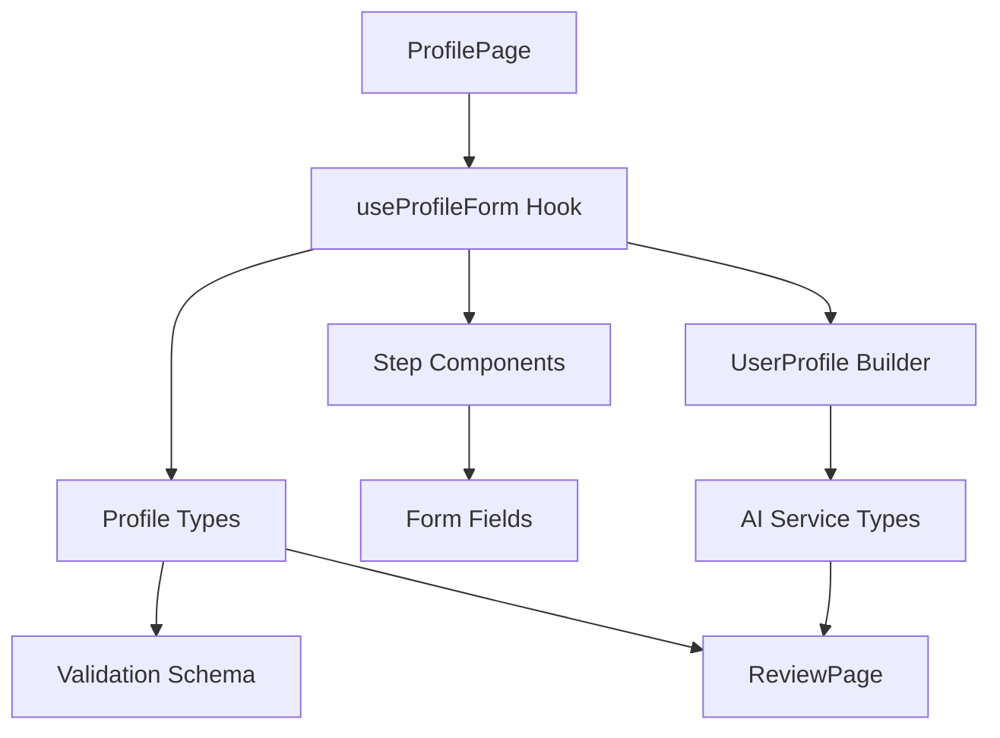

# Profile Data Flow: ProfilePage to ReviewPage

## Overview

This document outlines the complete data flow and component dependencies for profile data, from user input in `ProfilePage` to display in `ReviewPage`. Use this as a template when adding new profile fields or modifying existing ones.

## 🔄 Data Flow Diagram



## 📁 File Dependencies

### 1. Core Types (`src/components/Profile/types/profile.types.ts`)
- Define field type in `ProfileData` interface
- Update `ProfileFormState` if needed
- Add to `ProfileValidationErrors` if needed

### 2. Form Hook (`src/components/Profile/hooks/useProfileForm.ts`)
- Add field to initial state
- Update state management logic
- Add field-specific handlers if needed
- Update progress calculation if needed

### 3. Validation (`src/components/Profile/hooks/useProfileValidation.ts`)
- Add validation rules for new field
- Update error handling
- Add field-specific validation logic

### 4. Schema (`src/components/Profile/schemas/profileSchema.ts`)
- Add Zod schema definition for new field
- Define validation rules
- Add custom error messages

### 5. Step Component (e.g., `src/components/Profile/components/steps/PreferencesStep.tsx`)
- Add UI components for field input
- Implement onChange handlers
- Add error display
- Update progress indicators

### 6. AI Integration (`src/services/ai/core/UserProfileEnhancer.ts`)
- Update `UserProfile` transformation
- Add field mapping logic
- Update AI service integration

### 7. Review Display (`src/components/ReviewPage.tsx`)
- Add field to appropriate section
- Implement display formatting
- Add any field-specific visualizations
- Update summary calculations

## 🔍 Implementation Checklist

### Type System Updates
- [ ] Add field to `ProfileData` interface
- [ ] Update `ProfileFormState` if needed
- [ ] Add to `ProfileValidationErrors`
- [ ] Update `UserProfile` types

### Form Management
- [ ] Add to `useProfileForm` initial state
- [ ] Implement state management logic
- [ ] Add field-specific handlers
- [ ] Update progress calculation

### Validation
- [ ] Add Zod schema rules
- [ ] Implement validation logic
- [ ] Add error messages
- [ ] Update form validation

### UI Components
- [ ] Create/update form fields
- [ ] Add error displays
- [ ] Update progress indicators
- [ ] Implement onChange handlers

### AI Integration
- [ ] Update `UserProfileEnhancer`
- [ ] Add field mapping
- [ ] Update AI service contracts
- [ ] Test AI integration

### Review Display
- [ ] Add field to appropriate section
- [ ] Implement formatting
- [ ] Add visualizations
- [ ] Update summaries

## 🎯 Example: Adding a New Field

### 1. Add Type Definition
```typescript
// profile.types.ts
interface ProfileData {
  // ... existing fields
  newField: string[];  // Add new field
}
```

### 2. Update Form Hook
```typescript
// useProfileForm.ts
const initialState: ProfileFormState = {
  // ... existing state
  newField: [],
};
```

### 3. Add Validation
```typescript
// profileSchema.ts
export const profileSchema = z.object({
  // ... existing schema
  newField: z.array(z.string()).min(1, "Select at least one option"),
});
```

### 4. Create UI Component
```typescript
// PreferencesStep.tsx
<FormField
  label="New Field"
  error={getFieldError('newField')}
>
  <OptionGrid
    options={newFieldOptions}
    selected={profileData.newField}
    onToggle={(value) => onArrayToggle('newField', value)}
  />
</FormField>
```

### 5. Update Review Display
```typescript
// ReviewPage.tsx
<ProfileSection title="Section Title" icon={Icon} gradient="from-blue-500 to-purple-500">
  <DataRow 
    label="New Field" 
    value={profileData.newField.map(item => (
      <span key={item} className="inline-block px-2 py-1 m-1 bg-blue-50 text-blue-700 rounded-full text-sm">
        {item}
      </span>
    ))}
    icon={Icon} 
  />
</ProfileSection>
```

## 🔄 Data Migration

When adding new fields, consider:
1. Default values for existing users
2. Data migration strategy
3. Backward compatibility
4. State persistence updates

## 🧪 Testing Strategy

1. **Unit Tests**
   - Type validation
   - Form logic
   - Validation rules

2. **Integration Tests**
   - Form submission
   - Data flow
   - AI integration

3. **UI Tests**
   - Component rendering
   - User interactions
   - Error states

## 📝 Best Practices

1. **Type Safety**
   - Always define types first
   - Use strict type checking
   - Avoid any type

2. **Validation**
   - Add comprehensive validation
   - Include error messages
   - Handle edge cases

3. **UI/UX**
   - Follow existing patterns
   - Maintain consistency
   - Consider accessibility

4. **Performance**
   - Optimize state updates
   - Minimize re-renders
   - Handle large datasets

## 🚀 Deployment Considerations

1. **Feature Flags**
   - Consider gradual rollout
   - Add analytics tracking
   - Plan for rollback

2. **Documentation**
   - Update API docs
   - Add usage examples
   - Document edge cases

3. **Monitoring**
   - Add error tracking
   - Monitor performance
   - Track usage metrics 